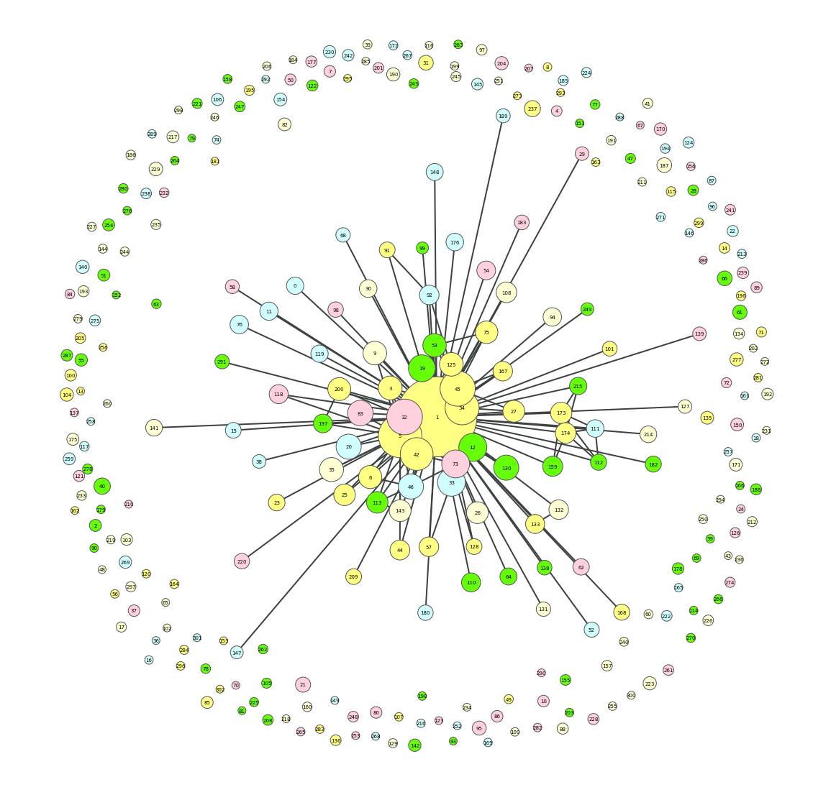
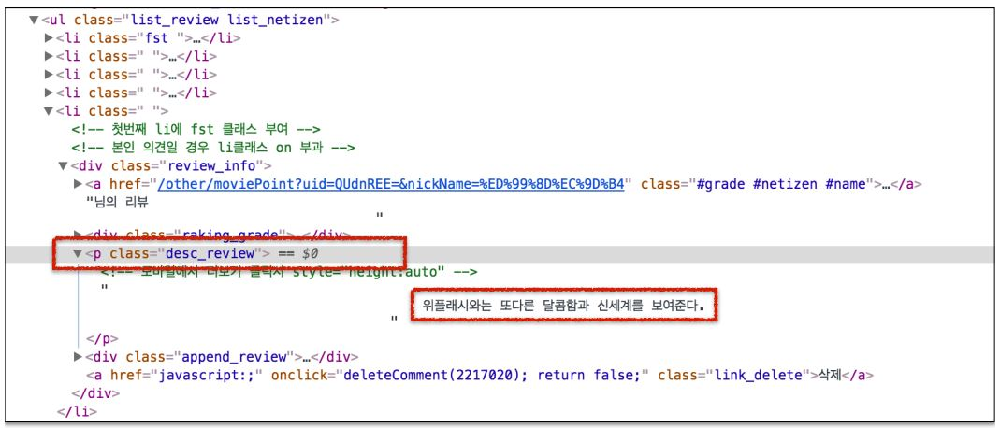
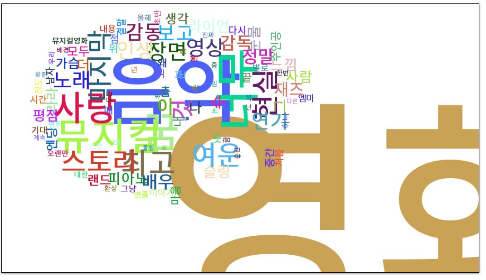
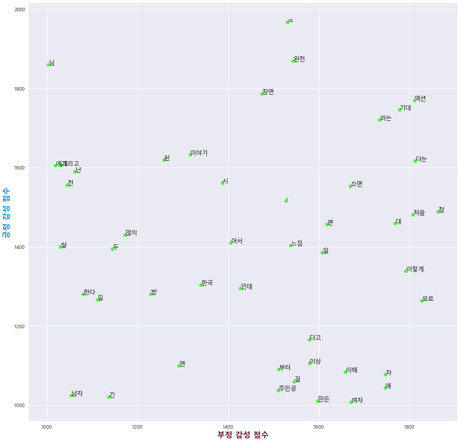

# Web-Crawling-and-Text-mining-with-Python-in-Korean

* Lecture materials for SNU Big Data Academy
* All the materials are provided in Korean

## Lecture notes and source codes for the lecture 
- website: http://bdi.snu.ac.kr/?cat=54

### Contents
<Part 0: Preliminaries>
1) Python preliminaries
2) Fundamentals of HTML & CSS

<Part 1: Web Crawling>
1) Web Crawling - 1: (lecture) Urllib & BeautifulSoup / (lab) Daum Dictionary Crawling
2) Web Crawling - 2: (lab) Daum Movie Crawling
3) Web Crawling - 3: (lecture) Splinter / (lab) Dictionary.com Crawling
4) Web Crawling - 4: (lab) Daum Movie Crawling (using Splinter)

 

<Part 2: Text Analysis>
1) Text Analysis - 1: (lecture) Fundamentals of Text Analysis / (lab) Text Data Processing (KoNlPy)
2) Text Analysis - 2: (lab) Text Data Processing (KoNlPy)
3) Text Analysis - 3: (lab) Text Data Exploration (Nltk)
4) Text Analysis - 4: (lab) Text Visualization (World Cloud & Network Graphs)
5) Text Analysis - 5: (lab) Sentiment Analysis with Korean Movie Reviews

 

